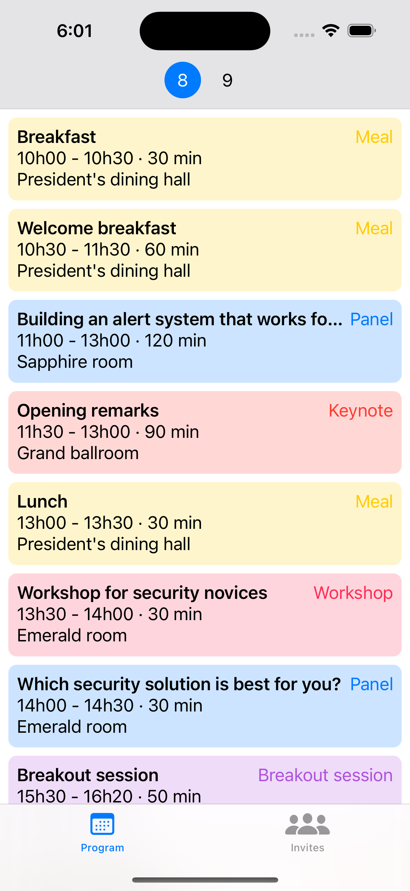
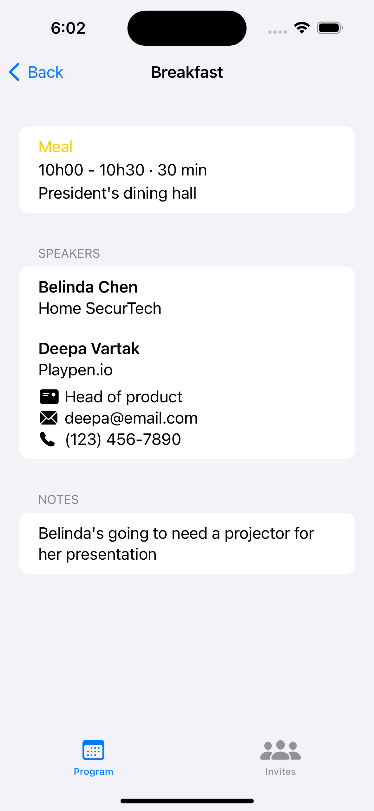
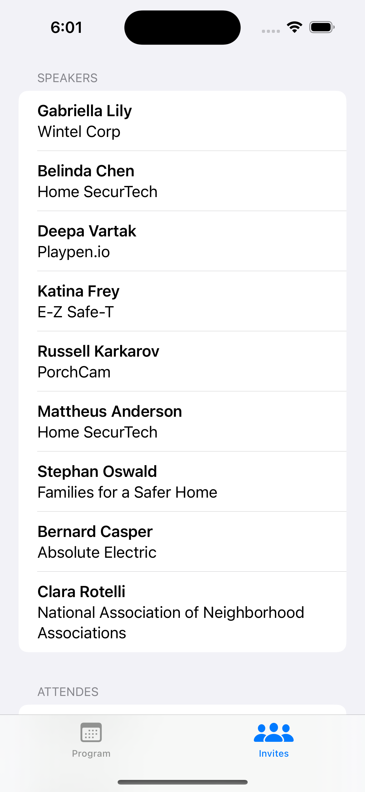
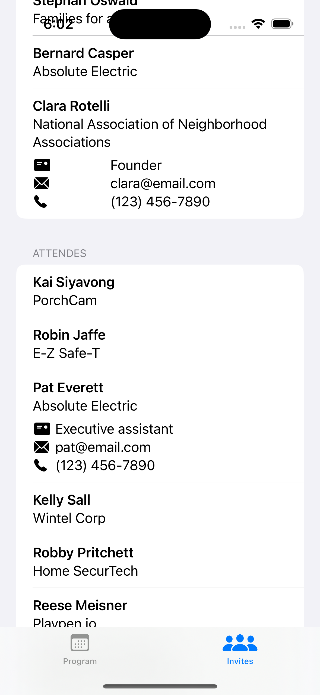

# Project Mobile development

For this project, we created an application for an event. This event is on two
days. There are multiples location in the same buildings, different type of
events. To make visitor journey easier, they need to have all the schedule and
information on their phones.

## Screenshots

| | |
|------------|------------| 
|  |  | 
| ||

## Build and Runtime Requirements

- Xcode 6.0 or later
- iOS 8.0 or later
- OS X v10.10 or later
- iCloud–enabled provisioning profile

## How to run

You can simply run and build the project using XCode.

## License

Code in this template project except third-party libraries and tools is in
public domain, feel free to copy-paste.

## Contact

| Prénom    | Nom       |
| --------- | --------- |
| Antoine   | `Picot`   |
| Camille   | `Biguet`  |
| Constance | `Garbado` |
